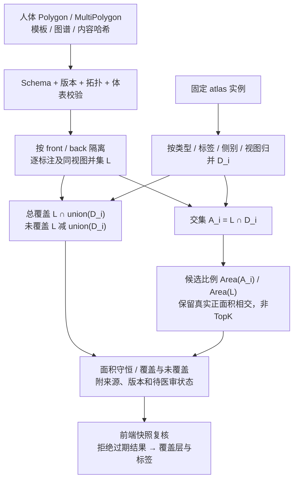
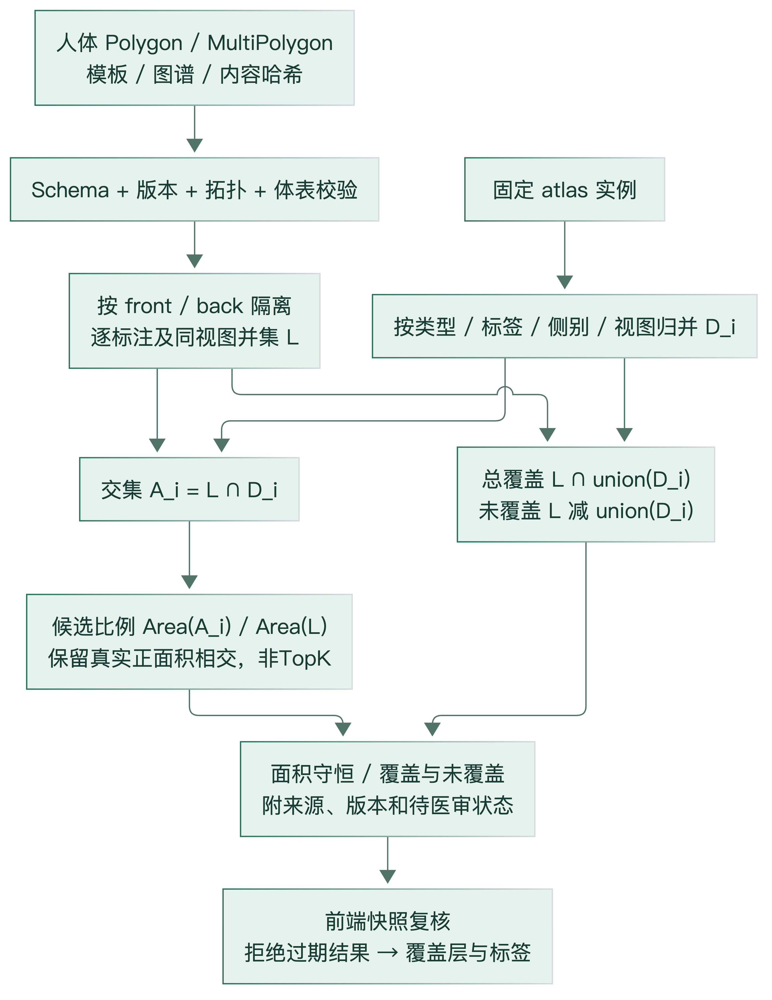

# 图 5：参考图谱几何匹配

来源：本项目当前源码审计，2026-11-02；对应证据见上级 技术结论与证据索引.md。流程图不是医学验证结果。

```mermaid
flowchart TB
  I["人体 Polygon / MultiPolygon
模板 / 图谱 / 内容哈希"] --> V["Schema + 版本 + 拓扑 + 体表校验"]
  V --> L["按 front / back 隔离
逐标注及同视图并集 L"]
  D["固定 atlas 实例"] --> G["按类型 / 标签 / 侧别 / 视图归并 D_i"]
  L --> X["交集 A_i = L ∩ D_i"]
  G --> X
  X --> C["候选比例 Area(A_i) / Area(L)
保留真实正面积相交，非TopK"]
  L --> U["总覆盖 L ∩ union(D_i)
未覆盖 L 减 union(D_i)"]
  G --> U
  U --> O["面积守恒 / 覆盖与未覆盖
附来源、版本和待医审状态"]
  C --> O
  O --> R["前端快照复核
拒绝过期结果 → 覆盖层与标签"]
```

